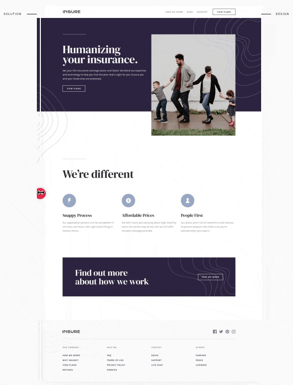

## The challenge

The challenge is to build out this landing page and get it looking as close to the design as possible.

User Stories:

- View the optimal layout for the component depending on their device's screen size
- See hover states for all interactive elements on the page

# [Frontend Mentor](https://www.frontendmentor.io) - Insure Landing Page

## Solution preview

  

   Solution preview by <a href="https://www.frontendmentor.io/solutions/css-html-flexbox-media-queries-G0l6ggg5i">Frontend Mentor</a>

### What I learned 🚀

-  Non-technical skills:
      -  Stackoverflow.com is my best friend
      -  Disect tutorial properly to find my solution
      -  Patience is a virtue
   -  Perserverance to finish the task, even through challenging times

-  Technical skills:
   -  How to turn an abstract concept into concrete results by breaking the task at hand into smaller tasks
   -  Ability to plan and stick to a work schedule with an estimated date of completion
   -  Responsive UI/UX development
   -  Using the chrome inspector to emulate different screen sizes
   -  Using CSS flexbox to create responsive and dynamic layouts
   -  Media queries for responsiveness through all devices and SASS for cross browsers solutions
   -  Using CSS animation as well
 

### Built with

- Semantic HTML5 Markup
- CSS custom properties
- AOS library
- API intergration
- SASS
- Flexbox
- CSS Grid
- Media Queries
- Javascript
- SCSS, BEM, Flexbox,  [Perfect Pixel](https://www.welldonecode.com/perfectpixel). Navbar functionality was built by pure CSS.

## Author

- Name: Darwin Basqui Andre
- Website - [basquidesign.com](https://www.basquidesign.com/)
- Frontend Mentor - [@basquii](https://www.frontendmentor.io/profile/basquii)
- Linkedin - [Darwin Andre](https://www.linkedin.com/in/basqui)

